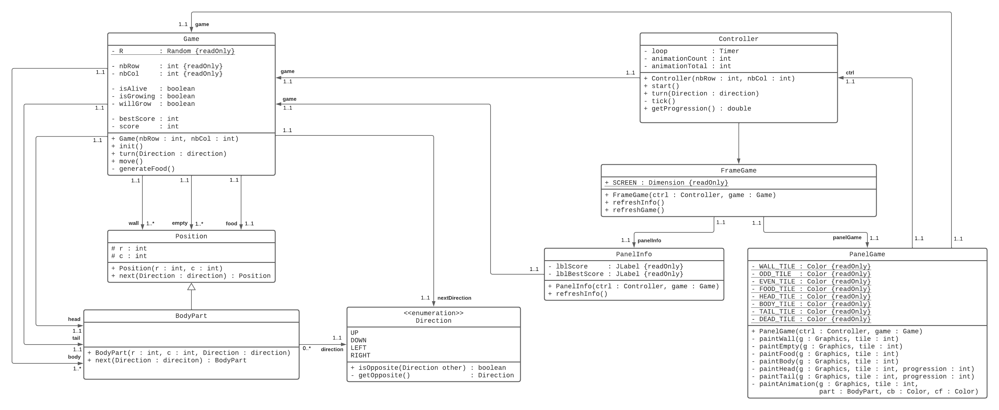
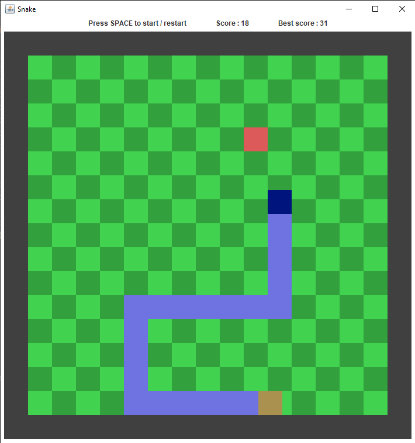

# Snake
## Information
This is a Java implementation of the classic game "Snake", made with the Java swing librairy.

The game contains classic features like move forward, turn, and eat. The game also displays the current score, as well as the session's high score. The snake's movements are animated.

# Class diagram
The game is designed around the MVC Pattern, each part is easily distinguishable thanks to the package.

Below is the class diagram of the application.

# Overview
Below is an overview of the game's GUI.

# Play the game
To play the game, in a terminal, go in the directory where Snake.jar is located and execute the following command :

`java -jar Snake.jar`